  

 

<h3 align="center">🛠 Languages and Tools</h3>

  
    

  

 

<h3 align="center">🚀 Projects</h3>

**[pisi-bump-bot](https://github.com/bbssyl/pisi-bump-bot)** — Tracks upstream GitHub releases for Pisi Linux contrib packages: an automated report bot on GitHub Actions, plus a local TUI for packagers.

**[omarchy-creality](https://github.com/bbssyl/omarchy-creality)** — Linux desktop plugin for Creality 3D printers: network auto-discovery, progress/temperature tracking, camera snapshot, pause/resume.

**[omarchy-netwatch](https://github.com/bbssyl/omarchy-netwatch)** — Local network device scanner for a Linux desktop bar that alerts when a new device joins the network.

 

<h3 align="center">📫 Connect with me</h3>

  
  

